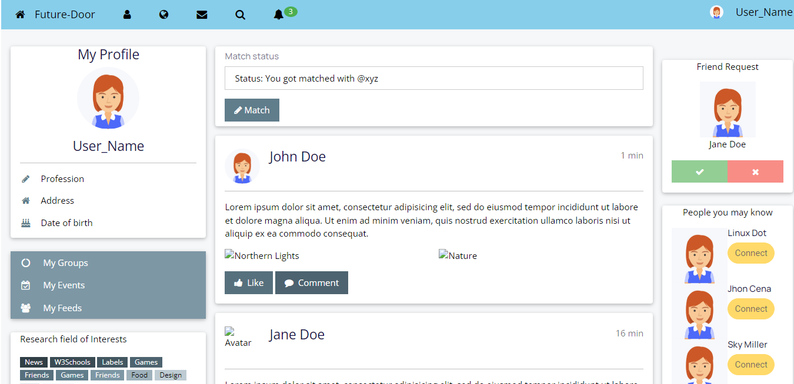
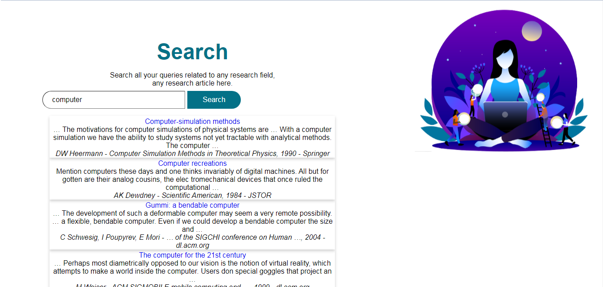
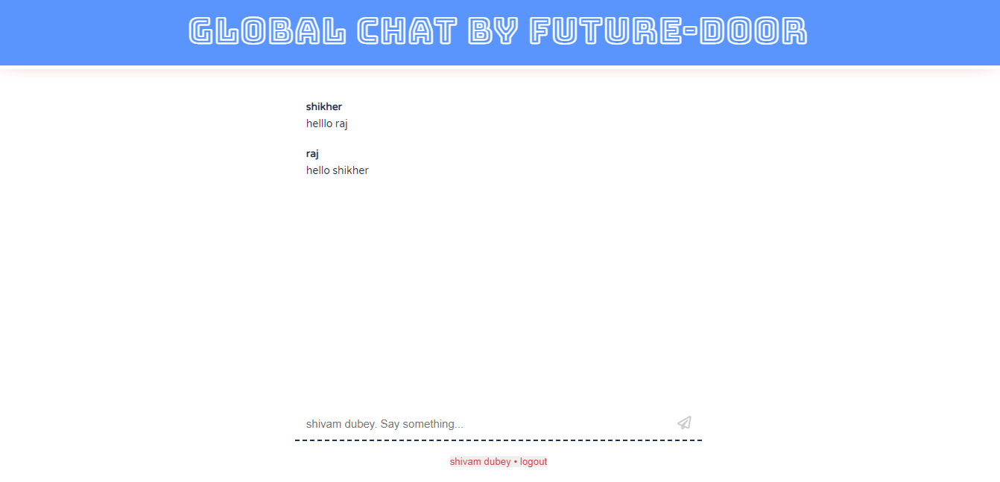
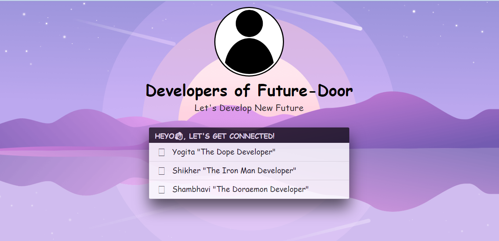

# Future-Door

Begin your journey of research with us.Join the first ever platform made exclusively for the people who are intent in persuing research as their main expertise.
As this project gives an ease at searching for research related information and research related people, In future this project can be used as a platform to hire research interns from various field of research. Also, as it provides an open chat system, people will get more aware about the current trends in research and what is happening globally in the field of research. We have planned to expand our project to reach a larger audience through Google ATS and user verdict.


## Acknowledgements

 - [I am over helmed in all humbleness and gratefulness to acknowledge my depth to all those who have helped me to put these ideas, well above the level of simplicity and into something concrete.
I would like to express my special thanks of gratitude to my team and Google .who gave me the golden opportunity to do this wonderful project on the topic of rearch as (Future-Door), which also helped me in doing a lot of Research and i came to know about so many new things. I am really thankful to them.
Any attempt at any level can ‘t be satisfactorily completed without the support and guidance of MY parents and friends.
I would like to thank my parents who helped me a lot in gathering different information, collecting data and guiding me from time to time in making this project, despite of their busy schedules, they gave me different ideas in making this project unique.]()


## API Reference

#### Get all items

```http
  GET /api/items
```

| Parameter | Type     | Description                |
| :-------- | :------- | :------------------------- |
| `api_key` | `string` | **Required**. Your API key |

#### Get item

```http
  GET /api/items/${id}
```

| Parameter | Type     | Description                       |
| :-------- | :------- | :-------------------------------- |
| `id`      | `string` | **Required**. Id of item to fetch |

#### add(num1, num2)

Takes two numbers and returns the sum.


## Demo

Insert gif or link to demo


## Screenshots


<--------------------------------------------------------------------------------------------------------------------------------------------------------->

<--------------------------------------------------------------------------------------------------------------------------------------------------------->

<------------------------------------------------------------------------------------------------------------------------------------------------------->

<------------------------------------------------------------------------------------------------------------------------------------------------------->

<------------------------------------------------------------------------------------------------------------------------------------------------------>

<------------------------------------------------------------------------------------------------------------------------------------------------------>

<------------------------------------------------------------------------------------------------------------------------------------------------------>

<------------------------------------------------------------------------------------------------------------------------------------------------------->

<------------------------------------------------------------------------------------------------------------------------------------------------------->

## Run Locally

Clone the project

```bash
  git clone https://https://github.com/SHIKHER09/Future-Door.git
```

Go to the project directory

```bash
  cd my-project
```

Install dependencies

```bash
  npm install
```

Start the server

```bash
  npm run start
```


## Features


- Search
- Feed
- Testmonials
- Global chat
- User Profile


## Documentation

[Documentation](https://linktodocumentation)


## Authors

- [@Shikher09](https://github.com/SHIKHER09)
- [@ShambhaviDixit09](https://github.com/ShambhaviDixit09)
- [@Yogitasaini](https://github.com/yogitasaini)


## Tech Stack

- HTML 
- CSS
- .JS
- FireBase
- Bootstrap


